# 🛡️ CivicGuardian AI

<p align="center">
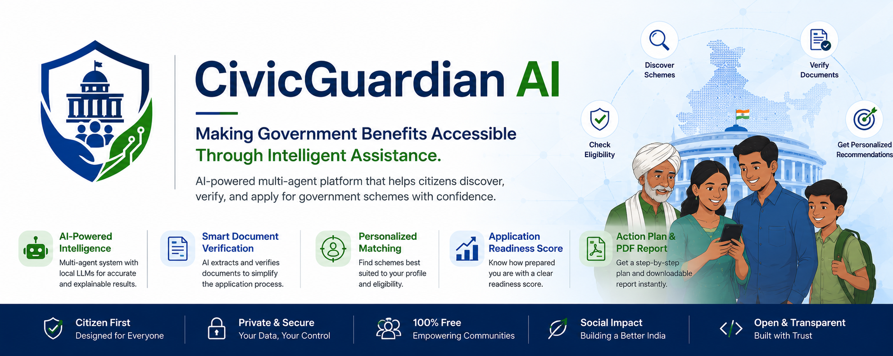
</p>

<h3 align="center">
🤖 Multi-Agent AI System for Government Scheme Discovery, Eligibility Verification & Citizen Assistance
</h3>

<p align="center">
Built for the <b>Kaggle AI Agents Intensive Capstone</b>
</p>

# 🎥 Demo

<p align="center">
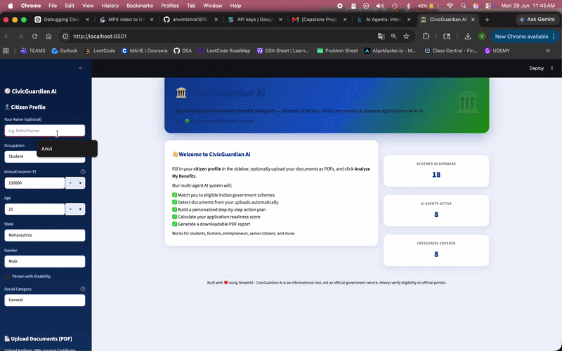
</p>

---

# 📌 Problem Statement

Millions of citizens remain unaware of government welfare schemes or struggle with lengthy application processes.

The challenges include:

- Finding relevant schemes
- Understanding eligibility
- Verifying required documents
- Preparing applications
- Receiving personalized guidance

CivicGuardian AI simplifies this entire process through a collaborative **multi-agent AI system** powered by Google Gemini.

---

# 🚀 Features

✅ Government Scheme Recommendation

✅ AI Eligibility Checker

✅ Personalized AI Advisor

✅ Intelligent Document Verification

✅ AI Document Insights

✅ Action Plan Generator

✅ Readiness Assessment

✅ PDF Report Generation

✅ Multi-Agent Coordination

---

# 🏛️ System Architecture

<p align="center">
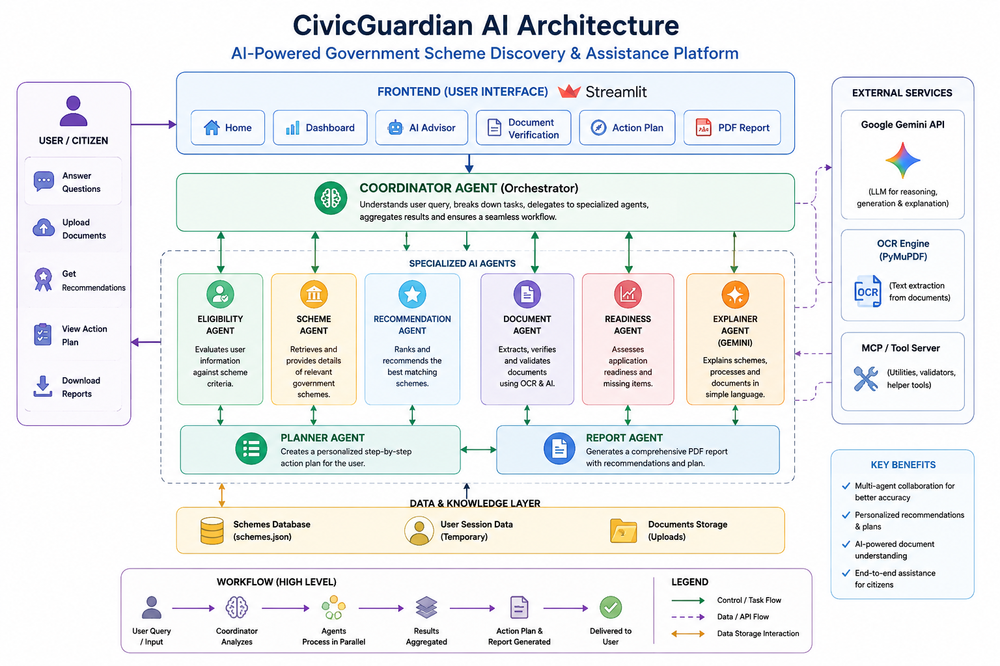
</p>

# 🧩 Architecture Highlights

CivicGuardian AI adopts a **multi-agent architecture**, where each AI agent is responsible for a focused task while a central coordinator orchestrates the overall workflow.

### Coordinator Agent
Acts as the central controller by receiving user inputs, coordinating agent execution, and aggregating results into a unified response.

### Planner Agent
Generates a structured execution plan, determining which analyses should be performed based on the user's information.

### Scheme Agent
Matches user profiles against the government scheme knowledge base to identify relevant welfare programs.

### Eligibility Agent
Evaluates eligibility by applying deterministic rules to user demographics, income, occupation, and uploaded information.

### Document Agent
Processes uploaded PDFs using text extraction techniques and classifies document types such as Aadhaar, PAN, Income Certificate, and others.

### Explainer Agent (Gemini)
Uses Google's Gemini model to analyze extracted document text, summarize key information, estimate confidence, verify document authenticity, and explain how the document can support government scheme applications.

### Recommendation Agent
Provides personalized explanations for why schemes are recommended, making the output easier for citizens to understand.

### Readiness Agent
Calculates an application readiness score, identifies missing documents, and highlights actions required before submission.

### Report Agent
Compiles all results into a structured PDF report that citizens can download and use as a personalized application guide.

---

### Why Multi-Agent?

Instead of relying on a single large prompt, CivicGuardian AI divides responsibilities among specialized agents. This modular design improves:

- Maintainability
- Explainability
- Scalability
- Reusability
- Reliability

Each agent performs a clearly defined responsibility while the Coordinator Agent combines their outputs into a coherent workflow.

# 🔄 Agent Interaction

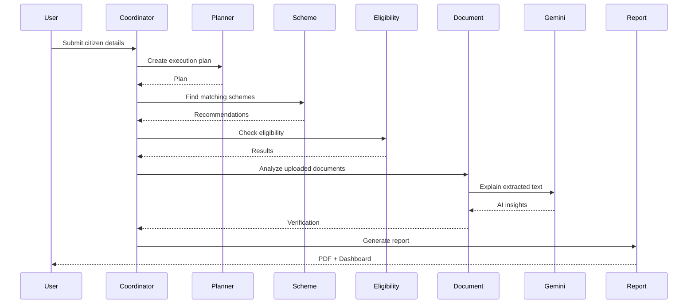

---

# 🤖 Multi-Agent Workflow

```
Citizen Input
      │
      ▼
Coordinator Agent
      │
 ┌────┼─────────────┐
 ▼    ▼             ▼
Planner   Scheme Agent   Document Agent
 │          │             │
 ▼          ▼             ▼
Eligibility Recommendation Document Analysis
Agent        Agent         Agent
 │
 ▼
Readiness Agent
 │
 ▼
Report Agent
 │
 ▼
Citizen Dashboard + PDF Report
```

---
# 📈 Project Metrics

| Metric | Value |
|---------|-------|
| AI Agents | 8 |
| LLM | Google Gemini |
| Document Types Supported | 10+ |
| Programming Language | Python |
| Framework | Streamlit |
| Report Format | PDF |
| Architecture | Multi-Agent |
| Deployment Ready | ✅ |

# 🧠 AI Agents

| Agent | Responsibility |
|--------|---------------|
| Coordinator Agent | Orchestrates complete workflow |
| Planner Agent | Creates execution plan |
| Scheme Agent | Finds matching government schemes |
| Eligibility Agent | Checks eligibility |
| Recommendation Agent | Explains recommendations |
| Document Agent | Detects uploaded documents |
| Explainer Agent | Uses Gemini for document understanding |
| Readiness Agent | Calculates application readiness |
| Report Agent | Generates downloadable report |


# ⚡ AI Pipeline

```text
Citizen Information
        │
        ▼
Coordinator Agent
        │
        ▼
Planner Agent
        │
        ├───────────────┐
        ▼               ▼
Scheme Agent     Document Agent
        │               │
        ▼               ▼
Eligibility      Gemini AI
        │               │
        └──────┬────────┘
               ▼
      Recommendation Agent
               ▼
      Readiness Assessment
               ▼
         Report Generation
               ▼
       Dashboard + PDF
```

---

# 📷 Application Screenshots

## Home

<p align="center">
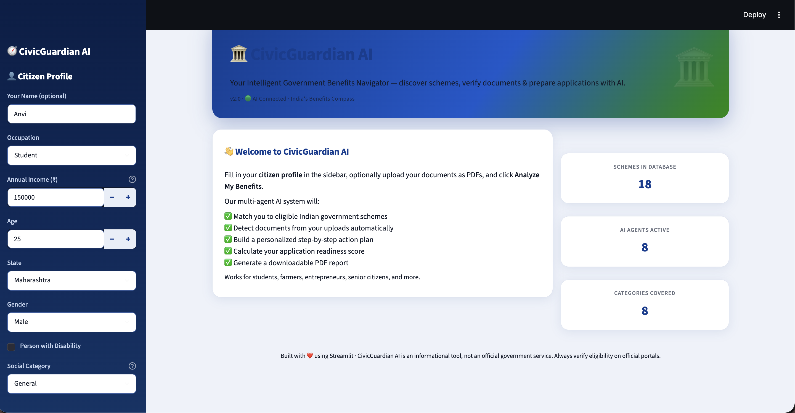
</p>

---

## Dashboard

<p align="center">
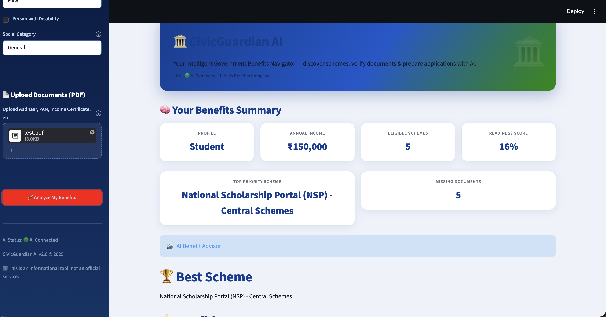
</p>

<p align="center">
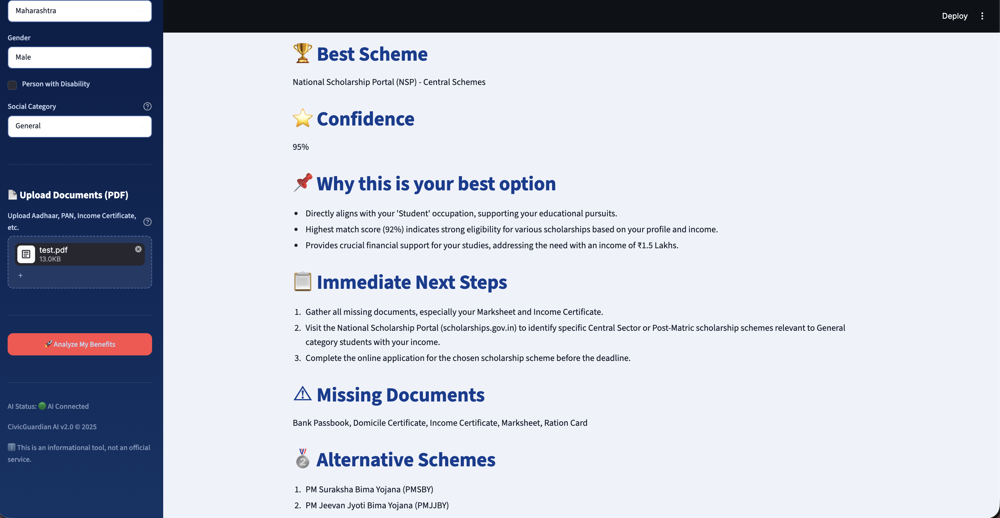
</p>

---

## Eligibility Results

<p align="center">
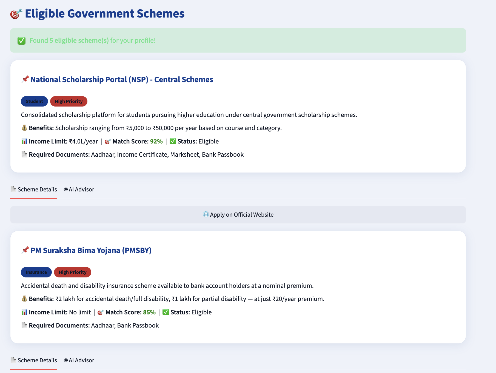
</p>

---

## AI Advisor

<p align="center">
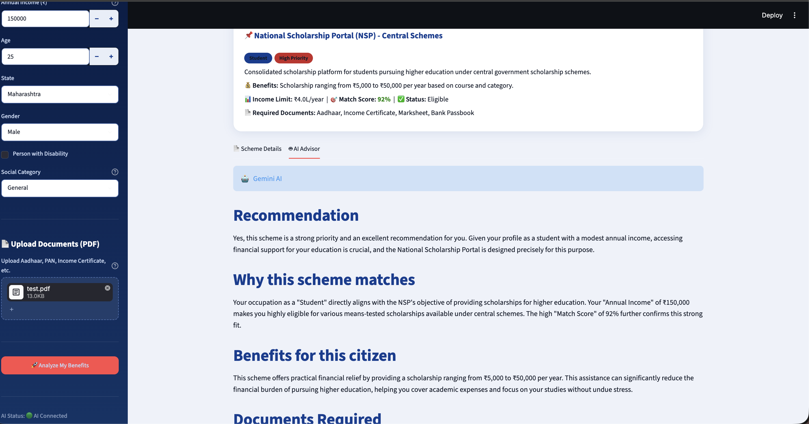
</p>

<p align="center">
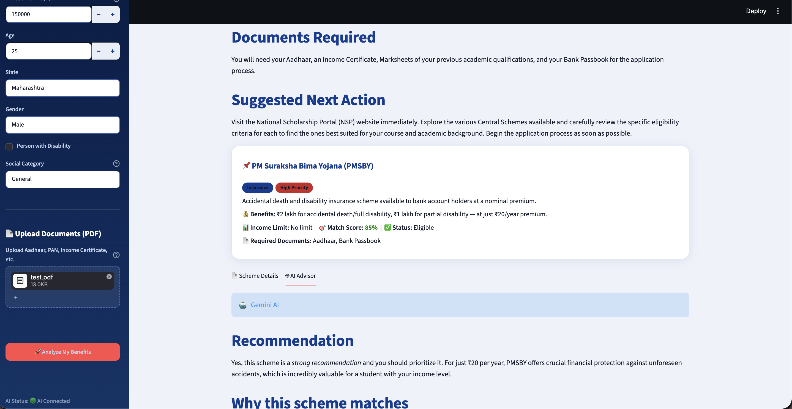
</p>

---

## Document Verification

<p align="center">
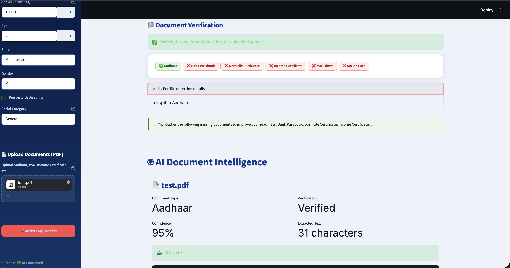
</p>

---

## Personalized Action Plan

<p align="center">
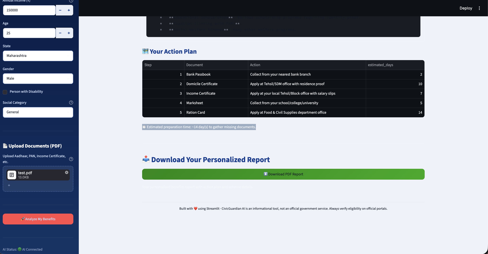
</p>

---

## PDF Report

<p align="center">
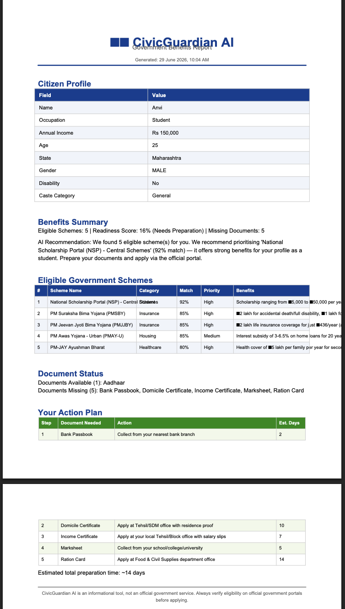
</p>

---

# ⚙️ Tech Stack

### AI

- Google Gemini
- Multi-Agent Architecture
- Prompt Engineering

### Backend

- Python
- Streamlit

### Document Processing

- PyMuPDF
- OCR-based Text Extraction

### Data

- JSON Knowledge Base

---

# 🏆 Technical Highlights

- 🤖 Multi-Agent AI Architecture
- 🧠 Google Gemini-powered Document Intelligence
- 📄 Automated PDF Document Verification
- 🎯 Rule-Based Eligibility Engine
- 📊 Personalized Readiness Scoring
- 📋 AI-Generated Action Plans
- 📑 One-Click PDF Report Generation
- 🖥️ Interactive Streamlit Dashboard
- 🔍 Explainable AI Recommendations
- ⚙️ Modular Agent Design for Extensibility

# 📂 Project Structure

```
CivicGuardian-AI
│
├── agents/
├── assets/
├── docs/
├── data/
├── frontend/
├── servers/
├── tests/
├── app.py
├── requirements.txt
└── README.md
```

---

# 🛠️ Installation

Clone the repository

```bash
git clone https://github.com/anvimishra1876-stack/CivicGuardian-AI-v2.git
```

Install dependencies

```bash
pip install -r requirements.txt
```

Run the application

```bash
streamlit run app.py
```

---

# 🎯 Future Improvements

- Voice-enabled assistant
- Regional language support
- Live government APIs
- OCR enhancements
- Mobile application
- Agent memory
- Retrieval-Augmented Generation (RAG)
- Authentication and user profiles

---

# 👩‍💻 Author

**Anvi Mishra**

B.Tech CSE (Data Science)

---

# 🏆 Kaggle AI Agents Intensive Capstone

This project demonstrates the use of **collaborative AI agents** to solve a real-world public service problem by combining planning, reasoning, document understanding, recommendation, and reporting into an end-to-end intelligent workflow.